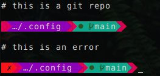
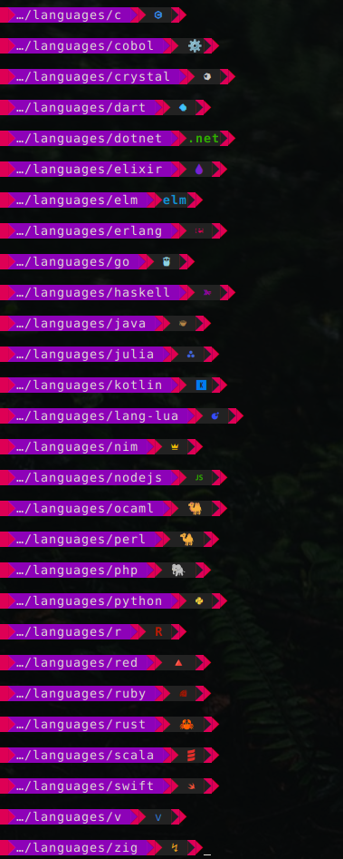
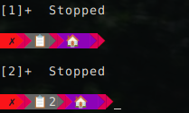

# Absolutely Vishus

The best ever [Starship](https://starship.rs/) theme for an informative, colorful, and succinct terminal prompt.

## Screenshots

Root user:

Languages:

Stopped jobs:

## Features

Includes support for the following modules out of the box: `character`, `jobs`, `username`, `directory`, `git_status`, and `git_branch`, as well as support for languages.

- **User**
  
  - shows `root` in a bright color when logged in as root
  
  - displays a star when sudo credentials are cached

- **Directories**
  
  - replaces common home directories with emojis to shorten prompt length

- **Git**
  
  - displays a circle for modifications
  
  - displays a sad face for conflicts
  
  - displays a symbol for stash and the number of stashes
  
  - displays branch name

- **Errors**
  
  - adds a red `X` if the last command was an error

- **Jobs**
  
  - displays an icon if there are paused jobs

- **Languages**
  
  - easy to customize languages; just change the `style = "..."` line
  
  - customized for many languages

## Todo

- add customization for others languages
